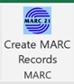
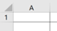
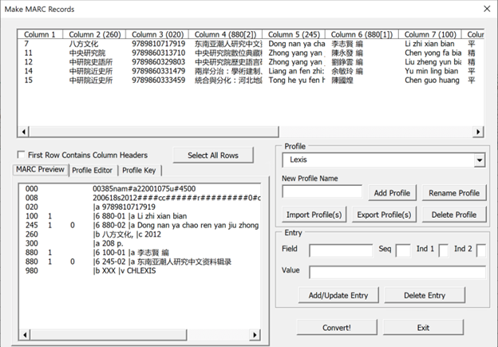
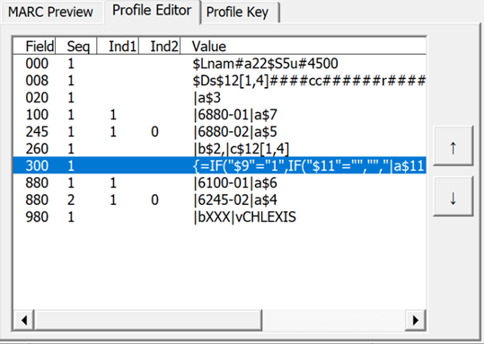
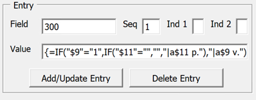

# Excel MARC Generator Plugin

This plugin allows you to generate MARC records from the data in an Excel spreadsheet.  This is done by creating profiles that map columns in the spreadsheet to fields of the record, as well as manipulating this data using Excel functions.  To install, download and run the following installer:

<a href="https://github.com/pulibrary/ExcelMarcGenerator/releases/latest/download/ExcelMARCInstaller.exe">ExcelMARCInstaller.exe</a>

After installing the plugin, the Excel ribbon should have a tab called “Library Tools”, with a button called “Create MARC Records”.
 
 

To use the tool, highlight the rows in the spreadsheet you wish to convert to MARC, then click the “Create MARC Records” button.  (Rather than highlighting specific rows, you can also highlight all the spreadsheet data by clicking the small arrow to the left of “A” and above “1”.)

 

After clicking the button, you will see a dialog that looks something like this.
 
 

Although this dialog looks complicated, once everything is set up properly, all you really need to do is click the “Convert!” button.  This will prompt you for a file name and location to save the file to.  Once you do this, the MARC records will be generated, and a dialog will appear letting you know how many records are in the file.

However, before MARC records can be generated, a profile must be created mapping the Excel columns to the MARC fields.  More instructions on how to do this are provided below.  In the example screenshot above, a profile called “Lexis” has already been created and applied to this data.  Once the profile has been created, you do not have to re-create it each time you run the tool.  This can be helpful for vendor-provided spreadsheets that have a consistent format.

## The Main Dialog

### Excel Data Display

The upper half of the window shows the spreadsheet data that was selected.  The column headers show which columns correspond to which MARC fields.  Note that not all columns need to be included in the MARC record, and some columns may be included in more than one place (for example, a publication date may appear in both the 008 and 264c fields).  Note also that in this window, column numbers are used rather than letters.  Although this differs from Excel’s convention, it can make it easier to edit and understand the profiles.

By default, MARC records will be generated for all the rows displayed.  However, you can also choose to generate records for selected rows.  You can do this by clicking an individual row, selecting a range of rows (by holding down the SHIFT key and selecting the first and last rows of the range), or selecting non-consecutive rows (by holding down the CTRL key and clicking each row you want to include).  If you start to select certain rows and later decide you want to include all the rows, simply click the “Select All Rows” button.  If you want to exclude the first row because it contains column headers, check the “First Row Contains Column Headers” box.  

If you click the “Convert!” button with only one row selected, you will be asked if you want to select all rows before proceeding.

### MARC Preview/Profile Editor

The lower left part of the window is a panel that shows a preview of the MARC record to be generated.  By default the first record is shown.  If you select a specific row in the upper half of the window, a MARC preview will be shown for that row.  This panel also has tabs called “Profile Editor” and “Profile Key”, which are described later on in this document.

### Profile Selector

The middle right part of the window has a drop-down menu that allows you to select different profiles.  You can also create and delete profiles and import or export profiles to an external file.

### Field Editor

The lower right part of the window says “Entry” and is used to add or edit specific fields in a profile.

## Profile Format

If you click the “Profile Editor” tab in the lower left panel, the display will change to show how the Excel columns are mapped to MARC fields.

 

You can click the “Profile Key” tab to see a detailed explanation of many of these symbols.  However, below are some key points:
-	The “Field” column shows the MARC field being described.  In the profiles, the leader field is referred to as “000”.
-	The “Seq” column will usually just say “1”.  However, if there is more than one field with a certain tag, each one will be assigned a unique sequence number so they can be easily identified.  In this example, there are two 880 fields, with the sequence numbers 1 and 2.
-	Ind1 and Ind2 refer to the two indicators.  A blank indicator simply appears blank, rather than as a slash.
-	The arrow buttons to the right of the profile are used to reorder the rows.  Simply select the row you want to move and then click the up or down arrows to move it.
-	The “Value” column shows the actual content of the field. The vertical bar character “|” is used as a subfield delimiter.  A dollar sign followed by a number refers to that column number within the spreadsheet.  The number may also be followed by a bracketed expression indicating that a certain portion of the column should be extracted.  In this example, the expression $12[1,4] means “Characters 1 to 4 of column 12”.  (In fact, column 12 is the publication date, and the first 4 characters are the year).  More detail about this format is provided in the “Profile Key”
-	Any Excel function may be included in the profile by enclosing it in curly braces with an equals sign before the function name.  For example, consider the following expression, used within field 300a to indicate the number of pages:

	{=IF(“$11”=””,””,”|a$11 p.”}

This uses the Excel IF function, which contains a condition, something to output if the condition is true, and something else to output if the condition is false.  So, in this case, the expression is saying “If column 11 is empty, output nothing; otherwise, output “|a” followed by column 11, followed by “ p.”.  This ensures that the subfield delimiter and “ p.” are only output if column 11 actually contains something.

If the value of a field is empty, then the field will not be included in the output.  This is also true if the field only contains a function that evaluates to an empty string.

### Editing Profiles

If you click on a specific field within the profile editor, the “Entry” section of the window in the lower right will populate with the values from that row.

If you change the indicators or value and click “Add/Update Entry”, then the field will be updated.  “Delete Entry” will delete the field entirely.

Each field is identified by its field name and sequence number.  If you change either of these, the plugin will assume you are referring to a different field.  For example, if you change the Seq number to “2” and click “Add/Update Entry”, a second field 300 will be created rather than replacing the existing one.  This is how you add new fields to the profile; simply type in a new field name, (or an existing field name with an unused “Seq” number), set the indicators and value accordingly, and click “Add/Update Entry”.  If you leave the Seq field blank, the plugin will automatically select an unused Seq number and create a new field in the profile.

### Adding, Importing, and Exporting Profiles

To create a new profile, type a name in “New Profile Name” and click “Add Profile”.  A nearly empty profile will appear, with some default values in the leader (000) and 008 fields.  You can then add additional fields to the profile using the process described above.

Note that the “Date 1” section of the 008 is set to the default value “DATE”.  This, of course, is not valid MARC, but it is assumed that this part of the 008 will end up being set to something from the spreadsheet.  So, be sure to edit the 008 and set it to something valid, either something from the spreadsheet or a default value like “uuuu”.  Note also that the language code in the 008 is set to “chi” by default.

It is recommended to regularly back up your profiles.  This can be done using the “Export Profile(s)” button.  After clicking it, a dialog will ask you which profiles you would like to export (you may select more than one).  You will then be prompted for a file name and location to save it to.  The export file can be used to share profiles with another user, or restore profiles.  (If you reinstall the plugin, all custom profiles will need to be restored).  Simply click “Import Profile(s)”, select the export file you created, then select which profiles you would like to import.

